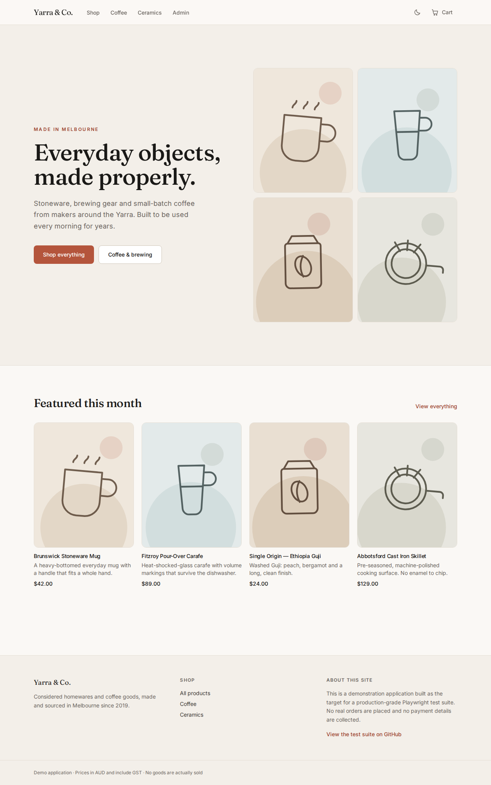

# Yarra &amp; Co. — a Playwright test-engineering portfolio

A full-stack ecommerce application, built deliberately as a realistic target for a
production-grade Playwright suite: **E2E, API, accessibility and visual regression
tests**, sharded across CI, deployed on every green build, and smoke-tested against
the live URL afterwards.

The application exists so the testing has something honest to bite on. The tests are
the point.

[](https://github.com/mitchelbailey/qaengineerportfolio/actions/workflows/ci.yml)
[](https://mitchelbailey.github.io/qaengineerportfolio/)
[](https://yarra-co.mitchelbailey.workers.dev)

|                              |                                                            |
| ---------------------------- | ---------------------------------------------------------- |
| 🟢 **Live application**      | **<https://yarra-co.mitchelbailey.workers.dev>**           |
| 📊 **Published test report** | **<https://mitchelbailey.github.io/qaengineerportfolio/>** |

The report is the real one, republished by CI on every push to `main` — including
when the suite is red. Browse it by project (`chromium`, `firefox`, `webkit`,
`mobile-chrome`, `api`, `a11y`, `visual`), open any test, and read its steps and
timings.



<sub>This screenshot is not a marketing asset — it is the actual committed visual
regression baseline (`VIS-001`) that CI diffs every build against.</sub>

---

## What I built, and what was AI-assisted

**AI-assisted:** the application scaffold (React SPA, Hono Worker, D1 schema,
styling), the Playwright infrastructure, and one worked example spec per suite type.

**My work:** the product browsing, product detail, cart and API test suites; the
defect investigations. The traceability IDs and QA documentation layer; and the assertion and reliability
refinements throughout — including reworking selectors and waits against the policy
in doc 06 after watching tests fail for the wrong reasons.

I'm a React developer moving into test engineering; building the target
application is the part I already knew how to do, and testing it properly is the
part I built this repository to learn and to show.

## What this repository demonstrates

| Capability                                                                     | Where to look                                                                                   |
| ------------------------------------------------------------------------------ | ----------------------------------------------------------------------------------------------- |
| **Layered test design** — the right check at the cheapest layer                | [`tests/`](tests/), [docs/01](docs/01-test-strategy.md)                                         |
| **API contract testing** against Zod schemas shared with production code       | [`tests/api/`](tests/api/)                                                                      |
| **Page Object Model** — locator-returning, no assertions inside                | [`tests/pages/cart.page.ts`](tests/pages/cart.page.ts)                                          |
| **Flake control as policy, enforced by lint**                                  | [docs/08](docs/06-selector-and-flake-policy.md), [`eslint.config.js`](eslint.config.js)         |
| **Accessibility testing** with `axe-core` (found a real WCAG failure)          | [`tests/a11y/`](tests/a11y/), [DEF-003](docs/05-defect-reports/DEF-003-accent-text-contrast.md) |
| **Visual regression** with the cross-platform baseline problem actually solved | [`tests/visual/`](tests/visual/), [docs/07](docs/07-ci-and-deployment.md)                       |
| **Defect investigation and written reports**                                   | [`docs/05-defect-reports/`](docs/05-defect-reports/)                                            |
| **Requirements traceability**                                                  | [docs/05](docs/04-traceability-matrix.md)                                                       |
| **CI/CD** — sharding, merged reports, gated deploy, post-deploy smoke          | [`.github/workflows/ci.yml`](.github/workflows/ci.yml)                                          |

## The suite at a glance

**78 distinct test cases → 144 executions per CI run**, plus 22 unit/component tests.
77 cases are active; `TC-022` is deliberately skipped and names DEF-004 in its title,
so the gap shows up in the report rather than disappearing.

| Suite              | Cases | Executions | What it covers                                                                                                                                           |
| ------------------ | ----- | ---------- | -------------------------------------------------------------------------------------------------------------------------------------------------------- |
| **E2E**            | 22    | 88         | Browsing, filtering, product detail, cart pricing, promo codes, checkout, admin sign-in — run across `chromium`, `firefox`, `webkit` and `mobile-chrome` |
| **API**            | 28    | 28         | Contract shape, pagination/facet edge cases, validation errors, auth (401 vs 403), image upload limits, admin order transitions                          |
| **Accessibility**  | 14    | 14         | `axe-core` WCAG 2.1 AA scans of every key page, plus error and modal states                                                                              |
| **Visual**         | 14    | 14         | Full-page baselines: light/dark themes, mobile viewport, all three checkout steps, admin, 404                                                            |
| **Unit/component** | 22    | 22         | GST and money arithmetic in integer cents; `QuantityStepper` and `Field` primitives                                                                      |

Every test carries a traceability ID in its title — `test('TC-014 | subtotal, shipping
and GST reflect the cart contents @smoke', …)` — so a result in the published report
maps straight back to [docs/04-traceability-matrix.md](docs/04-traceability-matrix.md).
Eight scenarios are tagged `@smoke` and re-run against the deployed site after
every deploy.

## Defects found

Four genuine defects, found by this suite and written up properly. These are the
portfolio material — more than the passing tests are.

| ID                                                                                  | Defect                                                                                                                                                                    | Severity       | Status                           |
| ----------------------------------------------------------------------------------- | ------------------------------------------------------------------------------------------------------------------------------------------------------------------------- | -------------- | -------------------------------- |
| [DEF-001](docs/05-defect-reports/DEF-001-patch-defaults-erase-fields.md)            | A partial `PATCH` silently erased fields the caller never sent — Zod's `.partial()` does not suppress `.default()`, so omitted fields were reset and returned `200 OK`    | S1 Major       | Closed, regression test `TC-043` |
| [DEF-002](docs/05-defect-reports/DEF-002-validation-layout-shift-swallows-click.md) | Clearing a validation error on blur collapsed 22px of layout, moving **Continue** out from under the pointer mid-click — the first click on the checkout path did nothing | S2 Significant | Closed, regression test          |
| [DEF-003](docs/05-defect-reports/DEF-003-accent-text-contrast.md)                   | Accent text failed WCAG AA contrast (4.5:1) on tinted backgrounds — caught by the accessibility suite's very first run                                                    | S3 Minor       | Closed, regression test          |
| [DEF-004](docs/05-defect-reports/DEF-004-instock-filter-checkbox-reverts.md)        | "In stock only" checkbox intermittently self-reverts and the grid never re-filters. Reproduces on Chromium and WebKit; **not yet reproduced by hand**                     | TBD            | **Open**                         |

DEF-004 is deliberately left open rather than quietly deleted or patched over. Its
test, `TC-022`, is marked `test.fixme` **with the defect ID in the test title** — so
the gap is visible in every published report. The three options were: delete the
test and lose the knowledge, loosen it until it passes and bless a real bug as
expected behaviour, or skip it and name the defect. Only the third is honest about
what is and isn't covered.

## The architectural decision that makes the suite fast

**Every browser context gets its own isolated data universe.** A cookie-based
session (`worker/middleware/session.ts`) gives each context a private copy of the
catalog, cart and orders.

That single decision buys:

- `fullyParallel: true` with **zero cleanup code** — no truncate-between-tests, no
  serial mode, no test ordering, no shared-fixture contention
- Tests that can seed whatever data they need without coordinating with any other test
- A post-deploy smoke run that seeds data **against the live public site** safely,
  because it can only ever touch its own session

Tests import only from [`shared/`](shared/) — the Zod schemas and money/GST logic
used by the app and the Worker too — and never from `app/` or `worker/` internals.
That boundary is what keeps the suite a genuine black-box exercise of the running
application rather than a restatement of its implementation.

Tests also run against the **production build** (`vite preview`), not the dev server.
No HMR client injecting itself into the page, no file watcher able to reload mid-test.
The reasoning is at the top of [`playwright.config.ts`](playwright.config.ts).

## CI pipeline

```
quality ──▶ playwright (3 shards) ──▶ report ──▶ publish-report (GitHub Pages)
               │
               └──────────────────▶ deploy (main only) ──▶ smoke (live URL)
```

- **`quality`** — ESLint (including the Playwright anti-flake rules), Prettier,
  TypeScript across all three tsconfigs, Vitest. The four checks don't gate each
  other, so one push can fix everything CI has to say.
- **`playwright`** — the full suite across 3 shards, each emitting a `blob` report.
- **`report`** — merges the shards into one HTML report. Runs on `always()`: a
  report that only exists when everything passed is a trophy cabinet, not a
  diagnostic.
- **`deploy`** — Cloudflare Worker, `main` only, gated behind a green suite.
- **`smoke`** — re-runs the `@smoke` tests against the **deployed URL**, because
  passing against `vite preview` on a runner is not the same claim as working in
  production.

Both Playwright workflows pin the same container image
(`mcr.microsoft.com/playwright:v1.62.0-noble`). Visual baselines are pixel
comparisons and font rendering shifts between runner image versions — a pinned image
means a baseline stays valid until someone deliberately changes the pin. Full
reasoning, including why loosening the diff threshold is the tempting wrong fix, is
in [docs/07-ci-and-deployment.md](docs/07-ci-and-deployment.md).

## QA documentation

| Doc                                                                      | Contents                                                                                           |
| ------------------------------------------------------------------------ | -------------------------------------------------------------------------------------------------- |
| [01 — Test strategy](docs/01-test-strategy.md)                           | Risk-based scope, what each layer is for, what is deliberately **not** tested, entry/exit criteria |
| [02 — Test environments and data](docs/02-test-environments-and-data.md) | Session isolation, the `/api/test/*` support endpoints, seeded accounts, fixture design            |
| [03 — Test cases](docs/03-test-cases.md)                                 | All 78 cases, with preconditions and expected results                                              |
| [04 — Traceability matrix](docs/04-traceability-matrix.md)               | Requirement → test case → spec file → status                                                       |
| [05 — Defect reports](docs/05-defect-reports/)                           | DEF-001 to DEF-004                                                                                 |
| [06 — Selector and flake policy](docs/06-selector-and-flake-policy.md)   | Selector priority, banned hard waits, `page.request` vs `request`, why the POM returns locators    |
| [07 — CI and deployment](docs/07-ci-and-deployment.md)                   | Pipeline shape, the visual-baseline platform problem, secrets                                      |

Every rule in doc 06 came from something that actually broke while building this
repo, including a comparison of the same spec written both ways, with both failure
traces.

## Running it locally

Requires **Node 22.22+** (see `.nvmrc`).

```bash
npm install
npx playwright install --with-deps
npm run dev      # http://localhost:5173 — React HMR, the Worker and local D1 in one process
npm test         # the full Playwright suite against a production build
```

`npm run dev` runs the _real_ Worker via `@cloudflare/vite-plugin`, so local
development and production are the same stack rather than a mock of it. No database
setup step: `ensureSchema` bootstraps D1 on the first request.

| Command                      | Purpose                                               |
| ---------------------------- | ----------------------------------------------------- |
| `npm run verify`             | Everything below, in order — the same gate as CI      |
| `npm run lint`               | ESLint, including the Playwright anti-flake rules     |
| `npm run typecheck`          | App, worker and test tsconfigs                        |
| `npm run test:unit`          | Vitest unit and component tests                       |
| `npm test`                   | Playwright, all projects                              |
| `npm run test:e2e`           | `chromium` + `firefox` + `webkit` + `mobile-chrome`   |
| `npm run test:api`           | API project only, no browser                          |
| `npm run test:a11y`          | `axe-core` scans                                      |
| `npm run test:visual`        | Screenshot comparison                                 |
| `npm run test:visual:update` | Regenerate baselines (do this on Linux for CI parity) |
| `npm run test:smoke`         | `@smoke`-tagged tests only                            |
| `npm run test:ui`            | Playwright UI mode                                    |
| `npm run test:report`        | Open the last local HTML report                       |

Seeded accounts for the admin area: `admin@yarra.test` and `viewer@yarra.test`,
password `Password123!` — single source of truth in
[`shared/demo-accounts.ts`](shared/demo-accounts.ts). The viewer account exists
so authorisation can be tested as more than a binary.

## Repository layout

```
app/       React SPA
worker/    Hono API + static asset serving (one Cloudflare Worker)
shared/    Domain code shared by app, worker and tests (Zod schemas, money/GST)
tests/     Playwright suite — e2e/ api/ a11y/ visual/ pages/ fixtures/ support/
docs/      Test strategy, test cases, traceability matrix, defect reports, CI, flake policy
```

## Stack

| Layer          | Choice                                                             |
| -------------- | ------------------------------------------------------------------ |
| UI             | React 19 · TypeScript · Vite 8 · React Router 8 · TanStack Query   |
| Styling        | Tailwind CSS v4 · Radix UI primitives · self-hosted variable fonts |
| API            | Hono on Cloudflare Workers                                         |
| Data           | Cloudflare D1 (SQLite), with per-session data isolation            |
| E2E            | Playwright · `@axe-core/playwright`                                |
| Unit/component | Vitest · Testing Library                                           |
| CI/CD          | GitHub Actions · GitHub Pages · Cloudflare Workers                 |
| Hosting        | A single Cloudflare Worker serves both the SPA and the API         |

## Notes on deliberate choices

- **The app fights back on purpose.** `SIMULATED_LATENCY_MS` puts real latency on
  API responses so loading states exist and are worth asserting on, and
  `FLAKY_WIDGET_FAILURE_RATE` fails 30% of review-widget requests to simulate a
  flaky third-party embed. `TC-030` intercepts that route rather than tolerating
  the failures — which is the correct answer to a genuinely unreliable dependency,
  and the whole reason it's in here.
- **Integer cents everywhere.** No floating-point dollars are stored, sent over the
  wire or summed. Prices are GST-inclusive per Australian retail convention, and
  `shared/money.test.ts` asserts that ex-GST + GST always reconciles to the
  inclusive amount.
- **Class-based dark mode.** A media-query-only theme cannot be driven by a
  user-facing control, and therefore cannot be tested end to end.
- **TypeScript 5.9, not 7.** TypeScript 7 is current, but `typescript-eslint@8`
  still declares `typescript <6.1.0` as a peer, and losing lint coverage on a repo
  whose entire point is engineering rigour is a bad trade.
- **`ENABLE_TEST_API` stays on in production.** Every `/api/test/*` endpoint is
  scoped to the caller's own session, so it exposes nothing — and leaving it on is
  what lets the post-deploy smoke job seed the data it needs against the live site.

— **Mitchel Bailey**, Melbourne · [github.com/mitchelbailey](https://github.com/mitchelbailey)
